## Cooking

I cook for fun! I even enjoy doing the dishes.

### Kimchi (Jan 2026)

I tried making kimchi (김장 /gim-jang/) for the first time! 

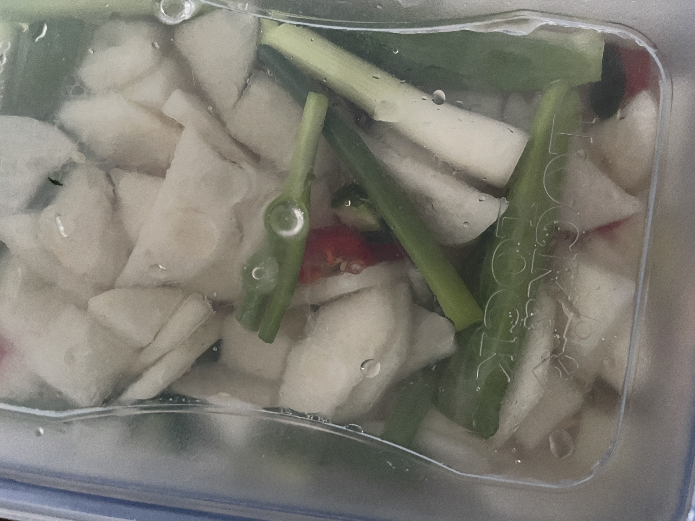
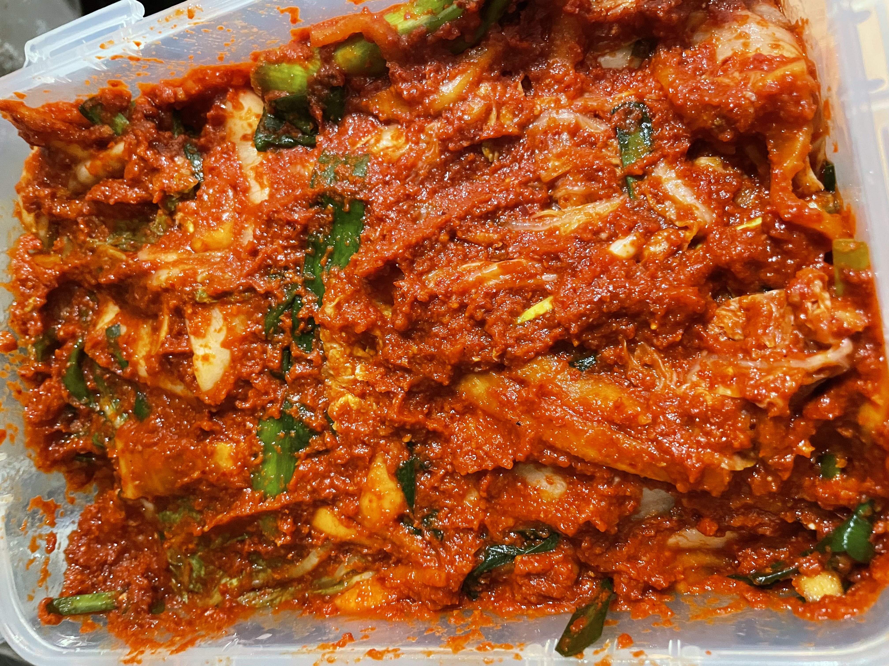

### Fried Chicken

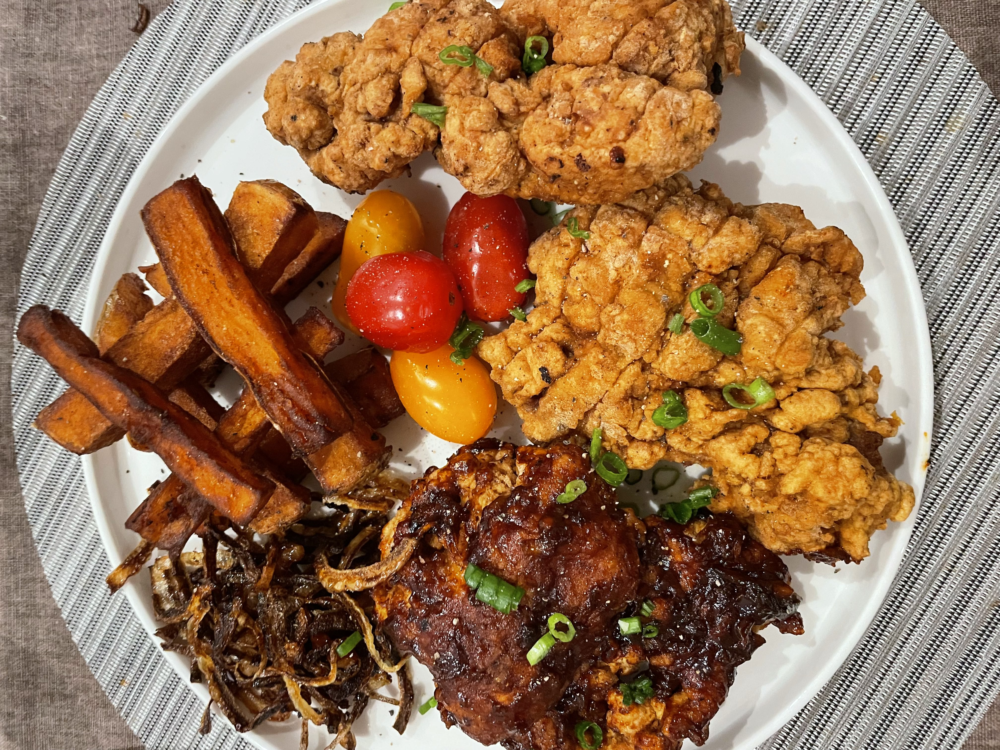
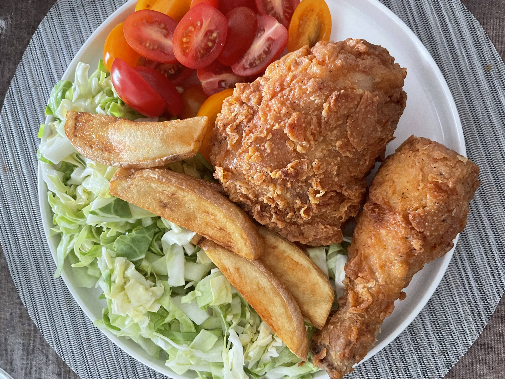
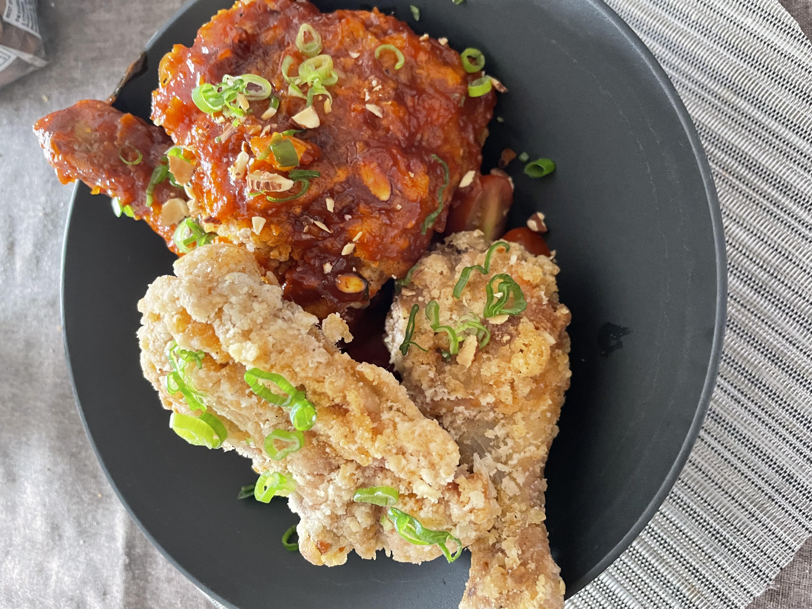

### Fried Pork Galbi

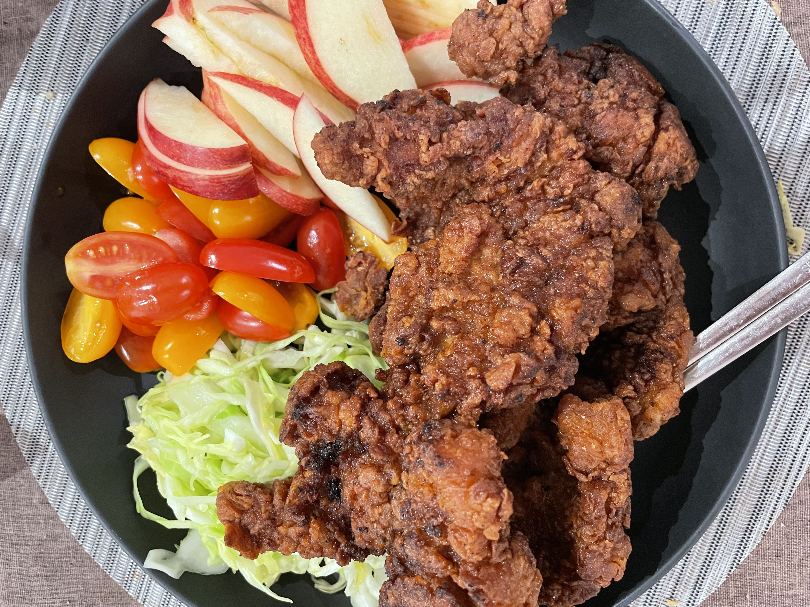
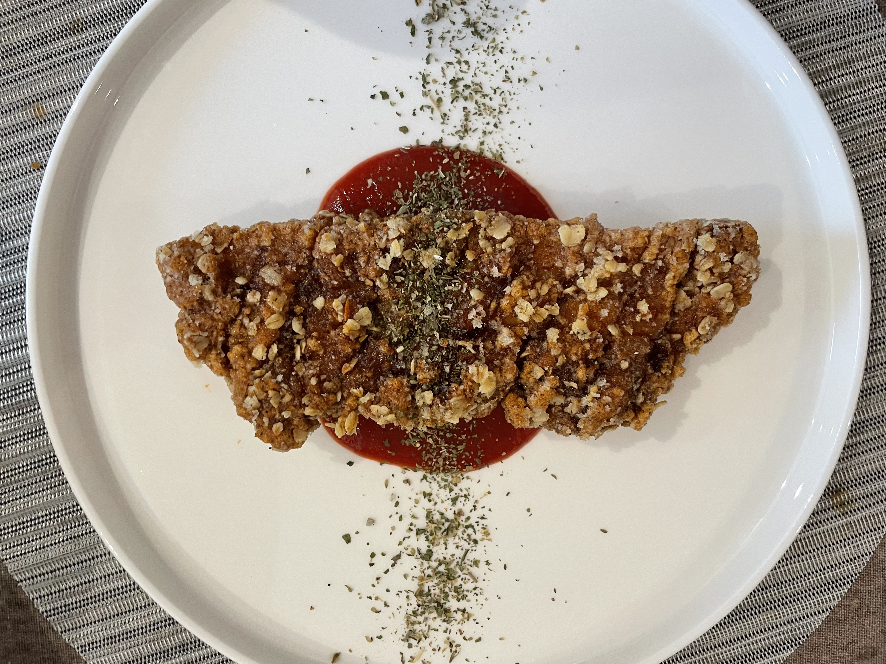
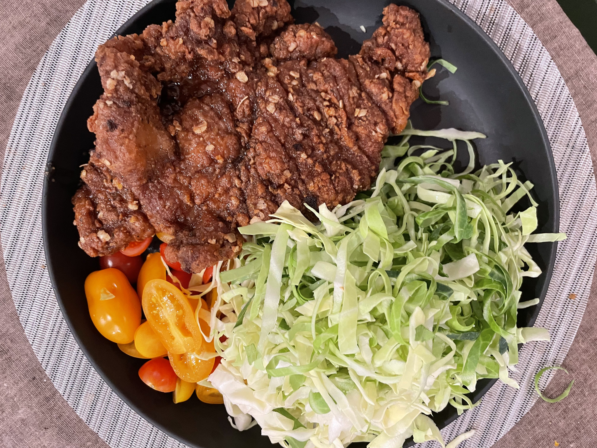

### Fried Rice

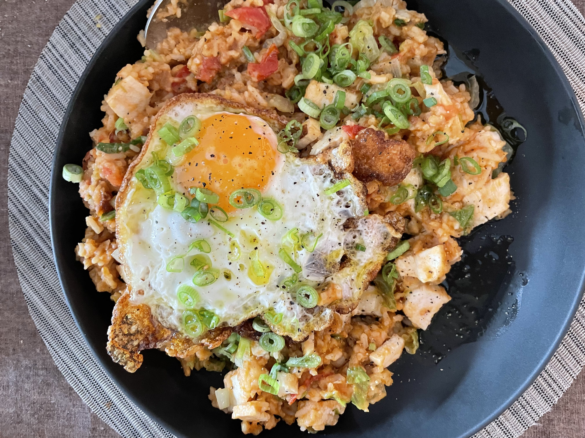

### Chicken Soup

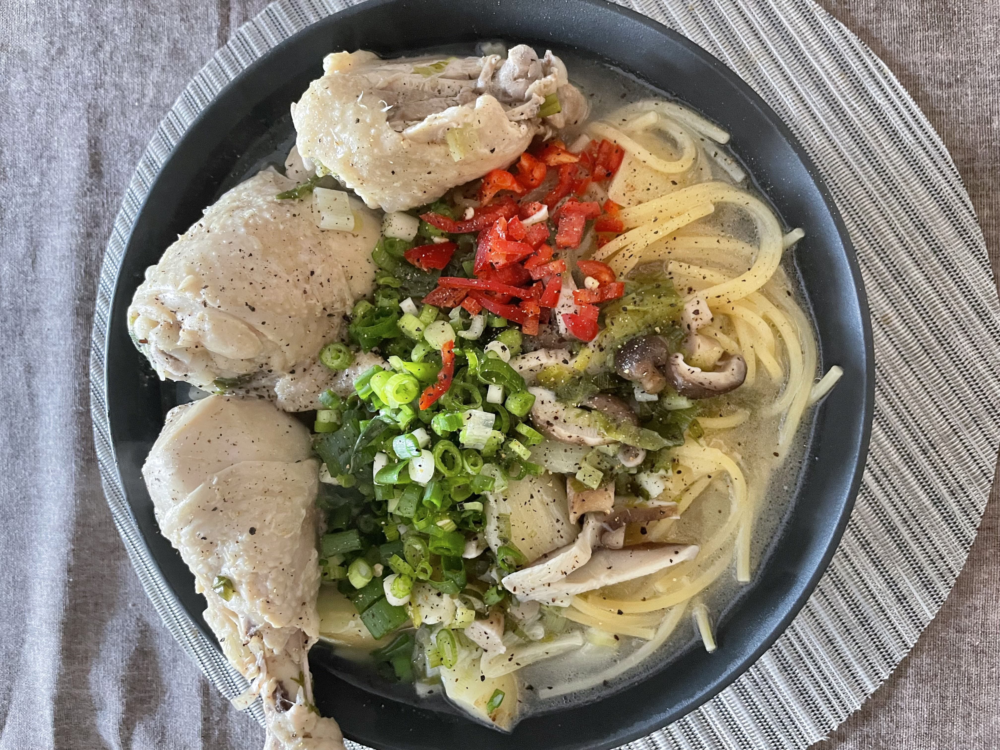

### Bibim Macaroni (?)

This is an adaptation of 비빔국수 (/bibim-guksu/, mixed salad noodles) with macaroni.
I used the remaining kimchi sauce after 김장.

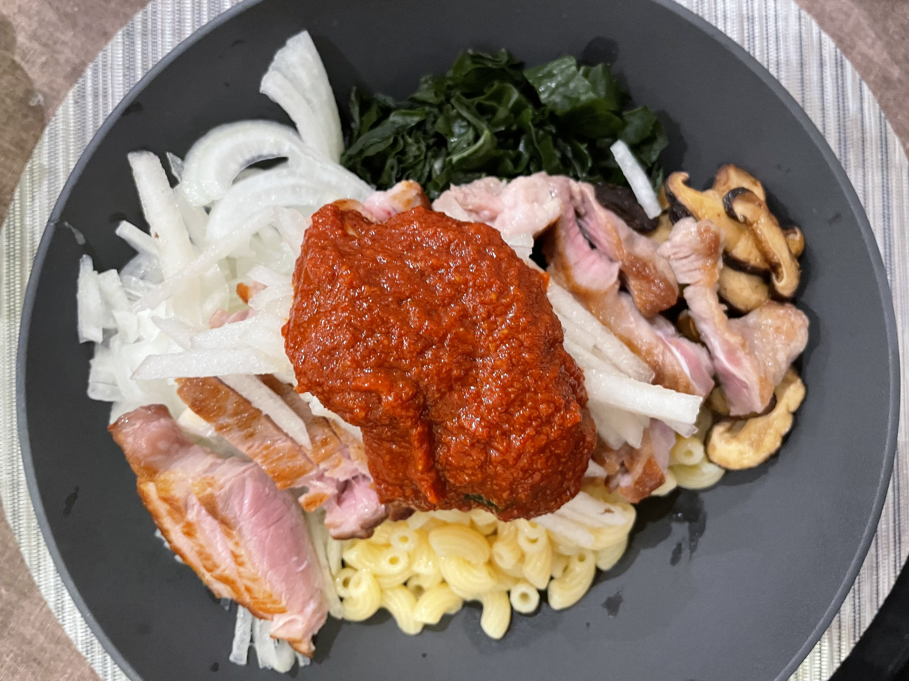

## Brewing

I also enjoy brewing alcohol. I had a great fun brewing Korean rice wines (탁주 /tak-ju/, 막걸리 /makgeoli/).

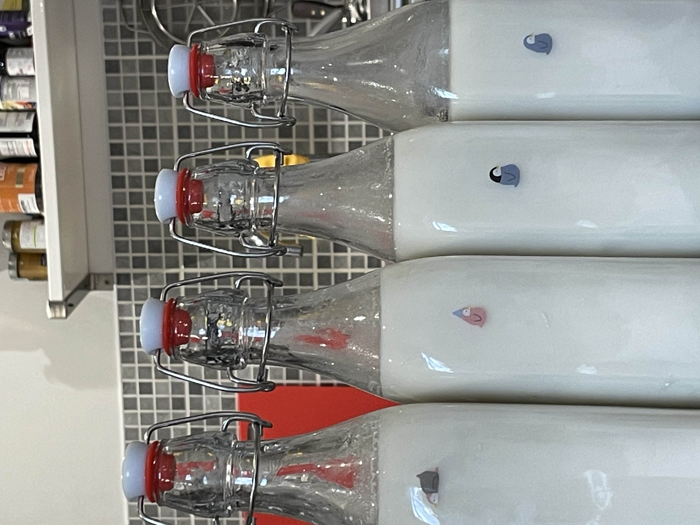
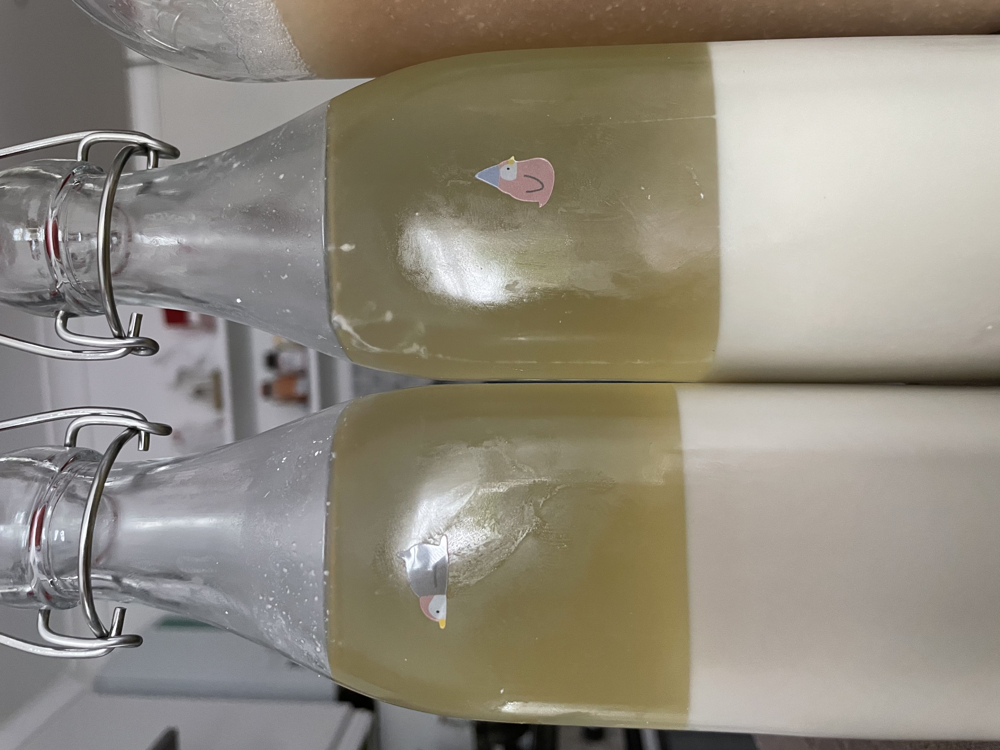