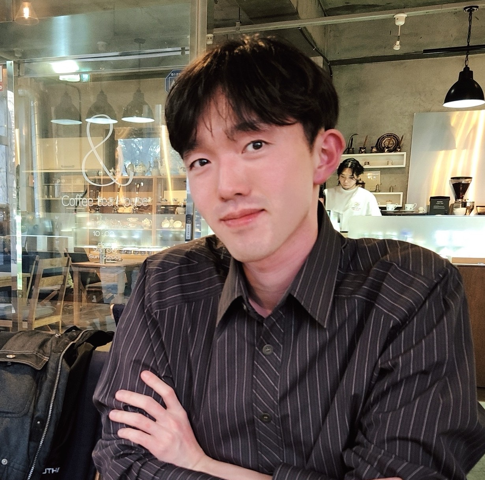

Hello! I am Seongho (/sung-ho/). 
I am in my final year of doctoral study in Computer Science at University College London.

email: `geronest at gmail dot com`

## Research Interests
- Reinforcement learning: RLHF, Robustness, Multi-Objective Learning, Reasoning
- Generative Models: LLMs, diffusion models, multimodal models
- Multi-agent systems: Game Theory, networked agents, emergent behaviour

## Non-Research Interests
- [Boardgame Design](boardgames.md)
- [Cooking + Brewing](cooking.md)
- [Reading](reading.md)
- Birds

## Links
- [Google Scholar]([https://scholar.google.com/](https://scholar.google.com/citations?user=jBSBdecAAAAJ&hl=en))
- [GitHub](https://github.com/geronest)
- [CV](CV_shson_2026.pdf)
