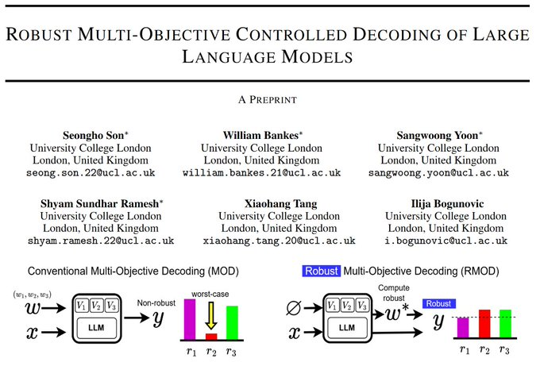
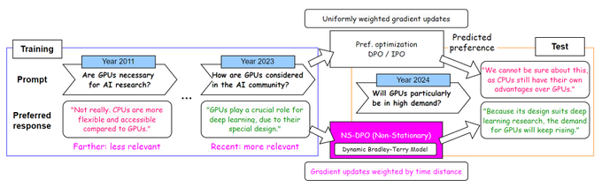

## Selected List of Papers
<table>
    <tr>
        <td style="width:30%">
            
        </td>
        <td>
            <b>Robust Multi-Objective Controlled Decoding of Large Language Models</b> 
            <b>Seongho Son*</b>, William Bankes*, Sangwoong Yoon*, Shyam Sundhar Ramesh*, Xiaohang Tang, Ilija Bogunovic 
            <i>ICLR 2026</i> 
            <a href="https://scholar.google.com/citations?view_op=view_citation&hl=en&user=jBSBdecAAAAJ&citation_for_view=jBSBdecAAAAJ:hMsQuOkrut0C">[Paper]</a>
        </td>
    </tr>

    <tr>
        <td style="width:30%">
            
        </td>
        <td>
            <b>Right Now, Wrong Then: Non-Stationary Direct Preference Optimization under Preference Drift</b> 
            <b>Seongho Son*</b>, William Bankes*, Sayak Ray Chowdhury, Brooks Paige, Ilija Bogunovic 
            <i>ICML 2025</i> 
            <a href="https://scholar.google.com/citations?view_op=view_citation&hl=en&user=jBSBdecAAAAJ&citation_for_view=jBSBdecAAAAJ:wbdj-CoPYUoC">[Paper]</a>
        </td>
    </tr>

    <tr>
        <td style="width:30%">
            
        </td>
        <td>
            <b>Creating pro-level AI for a real-time fighting game using deep reinforcement learning</b> 
            Inseok Oh, Seungeun Rho, Sangbin Moon, Seongho Son, Hyoil Lee, Jinyun Chung 
            <i>IEEE Transactions on Games, Vol. 14, No. 2, June 2022</i> 
            <a href="https://scholar.google.com/citations?view_op=view_citation&hl=en&user=jBSBdecAAAAJ&citation_for_view=jBSBdecAAAAJ:1qzjygNMrQYC">[Paper]</a>
        </td>
    </tr>

</table>